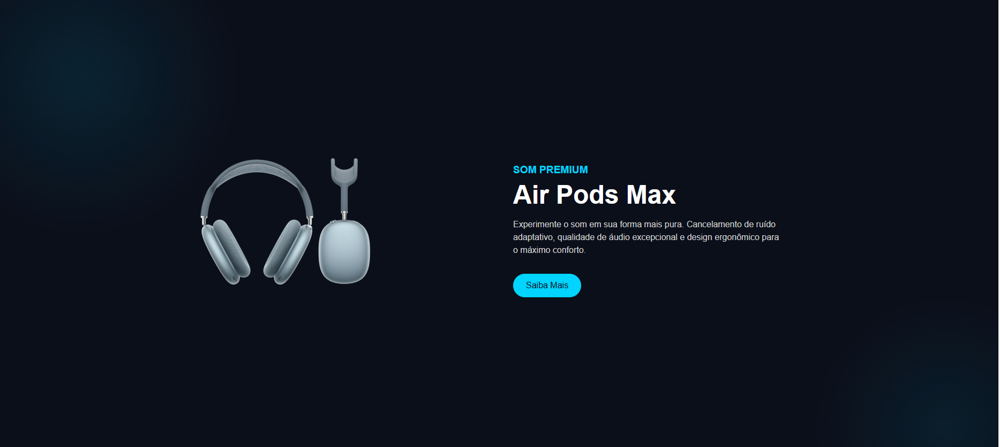

# 🎧 Landing Page - AirPods Max

Este é um projeto de **landing page desenvolvida em HTML e CSS**, inspirado no design moderno da Apple.  
O objetivo foi praticar estilização, tipografia e efeitos visuais, explorando a criação de uma interface limpa e atrativa.

## 🚀 Tecnologias utilizadas
- HTML5
- CSS3

## 🎨 Preview


## 📌 Funcionalidades
- Layout responsivo em construção
- Efeitos visuais no fundo com `radial-gradient`
- Animação de flutuação no produto

## 🔮 Melhorias futuras
- [ ] Criar novas páginas, simulando a navegação do site da Apple  
- [ ] Implementar **responsividade** para mobile e tablet  
- [ ] Adicionar **JavaScript** para interações dinâmicas  
- [ ] Explorar animações mais avançadas  

## 📂 Como executar
1. Clone este repositório:
   ```bash
   git clone https://github.com/seu-usuario/airpods-landing.git
